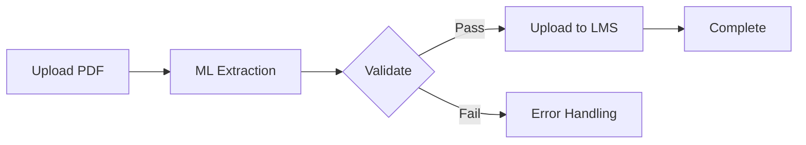

<div align="center">

# Smart Answer Sheet Processor

### Intelligent PDF Processing & LMS Automation System

[](https://opensource.org/licenses/MIT)
[](https://www.python.org/)
[](https://www.djangoproject.com/)
[](https://www.mongodb.com/)
[](https://pytorch.org/)
[](https://www.selenium.dev/)

<p align="center">
  <strong>Automate answer sheet processing with ML-powered data extraction and seamless LMS integration</strong>
</p>

[Features](#features) • [Quick Start](#quick-start) • [Documentation](#documentation) • [API Reference](#api-reference) • [Contributing](#contributing)

---

</div>

## Overview

**Smart Answer Sheet Processor** is an end-to-end automation system designed for educational institutions. It leverages machine learning and computer vision to extract student information from answer sheet PDFs and automatically uploads them to the Learning Management System (LMS).

```
┌─────────────┐    ┌──────────────┐    ┌─────────────┐    ┌─────────────┐
│  PDF Upload │ -> │ ML Extraction│ -> │  Validation │ -> │ LMS Upload  │
└─────────────┘    └──────────────┘    └─────────────┘    └─────────────┘
```

## Features

<table>
<tr>
<td width="50%">

### Core Functionality
| Feature | Description |
|---------|-------------|
| **Batch Upload** | Upload multiple PDFs simultaneously |
| **ML Extraction** | Auto-extract register numbers & subject codes |
| **Validation** | Real-time credential & URL verification |
| **LMS Automation** | Direct upload via Selenium |

</td>
<td width="50%">

### Advanced Features
| Feature | Description |
|---------|-------------|
| **Parallel Processing** | 3-5 concurrent uploads |
| **Real-time Status** | Live progress monitoring |
| **Recheck Config** | Verify setup without re-upload |
| **Modern UI** | Clean, responsive interface |

</td>
</tr>
</table>

## Tech Stack

<table>
<tr>
<td align="center" width="96">

<br>Python 3.9+
</td>
<td align="center" width="96">

<br>Django 5.2
</td>
<td align="center" width="96">

<br>MongoDB
</td>
<td align="center" width="96">

<br>PyTorch
</td>
<td align="center" width="96">

<br>OpenCV
</td>
<td align="center" width="96">

<br>Selenium
</td>
</tr>
</table>

### Technology Matrix

| Category | Technology | Version | Purpose |
|:---------|:-----------|:--------|:--------|
| **Backend** | Django | `5.2.7` | Web framework & REST API |
| **Database** | MongoDB | `4.0+` | NoSQL document storage |
| **ML/DL** | PyTorch | `2.1.1` | Deep learning models |
| **Vision** | OpenCV | `4.8.1` | Image processing |
| **OCR** | Tesseract | `5.0+` | Text recognition |
| **Automation** | Selenium | `4.15.2` | Browser automation |
| **Detection** | Ultralytics | `8.0+` | YOLO object detection |

## Requirements

<table>
<tr>
<td>

### System Requirements
| Component | Minimum | Recommended |
|:----------|:--------|:------------|
| **OS** | Windows 10 / Ubuntu 20.04 | Windows 11 / Ubuntu 22.04 |
| **Python** | 3.9 | 3.11+ |
| **RAM** | 4 GB | 8 GB+ |
| **Storage** | 2 GB | 5 GB+ |
| **GPU** | - | CUDA compatible |

</td>
<td>

### Dependencies
| Package | Version |
|:--------|:--------|
| `django` | Latest |
| `torch` | Latest |
| `opencv-python` | Latest |
| `selenium` | Latest |
| `pymongo` | Latest |
| `ultralytics` | Latest |

</td>
</tr>
</table>

## Quick Start

### 1. Clone & Setup

```bash
# Clone repository
git clone https://github.com/d-kavinraja/Smart-answer-sheet-processor.git
cd Smart-answer-sheet-processor

# Create virtual environment
python -m venv venv

# Activate (Windows)
venv\Scripts\activate

# Activate (Linux/macOS)
source venv/bin/activate

# Install dependencies
pip install -r requirements.txt
```

### 2. Database Setup

```bash
# Ensure MongoDB is running
mongosh

# Run setup script
python setup_mongodb.py
```

### 3. Run Application

```bash
cd lms_automation_project

# Apply migrations
python manage.py migrate

# Create admin user
python manage.py createsuperuser

# Start server
python manage.py runserver
```

### 4. Access Application

| Interface | URL |
|:----------|:----|
| **Web App** | http://127.0.0.1:8000 |
| **Admin Panel** | http://127.0.0.1:8000/admin |

## Documentation

### Workflow



### Status Codes

| Status | Description |
|:-------|:------------|
| `pending` | Awaiting processing |
| `processing` | Currently extracting |
| `extracted` | Data extracted successfully |
| `uploading` | Uploading to LMS |
| `uploaded` | Successfully uploaded |
| `failed` | Error occurred |

## API Reference

### Endpoints

| Method | Endpoint | Description |
|:-------|:---------|:------------|
| `GET` | `/` | Main dashboard |
| `POST` | `/api/upload/` | Upload PDF files |
| `POST` | `/api/process/<id>/` | Extract data from PDF |
| `POST` | `/api/recheck/<id>/` | Verify configuration |
| `POST` | `/api/upload-lms/<id>/` | Upload to LMS |
| `POST` | `/api/upload-multiple-lms/` | Batch upload |
| `DELETE` | `/api/delete/<id>/` | Delete document |
| `GET` | `/api/status/<id>/` | Get upload status |
| `GET` | `/api/uploads/` | List all uploads |

### Example Request

```bash
# Upload PDF
curl -X POST http://127.0.0.1:8000/api/upload/ \
  -F "pdf_files=@answer_sheet.pdf"

# Check Status
curl http://127.0.0.1:8000/api/status/1/
```

### Example Response

```json
{
  "success": true,
  "data": {
    "id": 1,
    "filename": "answer_sheet.pdf",
    "registerNumber": "212221230038",
    "subjectCode": "19AI505",
    "status": "uploaded",
    "isUploaded": true
  }
}
```

## Project Structure

```
Smart-answer-sheet-processor/
│
├── lms_automation_project/
│   ├── lms_project/             # Django settings
│   │   ├── settings.py
│   │   ├── urls.py
│   │   └── wsgi.py
│   │
│   ├── pdf_processor/           # Main application
│   │   ├── models.py            # Database models
│   │   ├── views.py             # API endpoints
│   │   ├── urls.py              # URL routing
│   │   └── templates/           # HTML templates
│   │
│   ├── services/                # Core services
│   │   ├── ml_service.py        # ML extraction
│   │   ├── lms_automation.py    # Selenium automation
│   │   └── parallel_lms_uploader.py
│   │
│   ├── models/                  # ML model weights
│   └── media/                   # Uploaded files
│
├── requirements.txt
├── db-setup.md
├── LICENSE
└── README.md
```

## Database Schema

### Collections

<table>
<tr>
<td width="33%">

#### credentials
```javascript
{
  "_id": ObjectId,
  "registerNumber": "212221230038",
  "username": "22008681",
  "password": "****",
  "createdAt": ISODate
}
```

</td>
<td width="33%">

#### subject_code_urls
```javascript
{
  "_id": ObjectId,
  "subject_code": "19AI505",
  "url": "https://lms...",
  "createdAt": ISODate
}
```

</td>
<td width="33%">

#### uploaded_files
```javascript
{
  "_id": ObjectId,
  "filename": "file.pdf",
  "status": "Uploaded",
  "django_id": 1
}
```

</td>
</tr>
</table>

## Troubleshooting

<details>
<summary><b>MongoDB Connection Failed</b></summary>

```bash
# Check MongoDB status
mongosh

# Windows: Start service
net start MongoDB

# Linux
sudo systemctl start mongod
```
</details>

<details>
<summary><b>Credentials Not Found</b></summary>

```javascript
// Add credentials via mongosh
db.credentials.insertOne({
  registerNumber: "212221230038",
  username: "22008681",
  password: "password123"
})
```
</details>

<details>
<summary><b>Port Already in Use</b></summary>

```bash
# Use different port
python manage.py runserver 8001
```
</details>

## Contributing

We welcome contributions! Please follow these steps:

1. **Fork** the repository
2. **Create** a feature branch (`git checkout -b feature/AmazingFeature`)
3. **Commit** changes (`git commit -m 'Add AmazingFeature'`)
4. **Push** to branch (`git push origin feature/AmazingFeature`)
5. **Open** a Pull Request

### Contributors

<a href="https://github.com/d-kavinraja/Smart-answer-sheet-processor/graphs/contributors">
  
</a>

## License

This project is licensed under the **MIT License** - see the [LICENSE](LICENSE) file for details.

<table>
<tr>
<td>Commercial use</td>
<td>Modification</td>
<td>Distribution</td>
<td>Private use</td>
</tr>
</table>

## Support

<table>
<tr>
<td>

### Get Help
- Check [Documentation](#documentation)
- Report [Issues](https://github.com/d-kavinraja/Smart-answer-sheet-processor/issues)
- Start [Discussion](https://github.com/d-kavinraja/Smart-answer-sheet-processor/discussions)

</td>
<td>

### Resources
- [Django Docs](https://docs.djangoproject.com/)
- [MongoDB Manual](https://docs.mongodb.com/)
- [PyTorch Tutorials](https://pytorch.org/tutorials/)

</td>
</tr>
</table>

---

<div align="center">

**Star this repo if you find it helpful!**

Made by [Kavinraja D](https://github.com/d-kavinraja)

</div>

